```mermaid
graph LR
    %% =====================================================================================
    %% LEFT SIDE: SYSTEM TOPOLOGY & VISUAL FLOW
    %% =====================================================================================
    
    subgraph Architecture ["SYSTEM ARCHITECTURE & DATA TOPOLOGY"]
        direction TB
        
        %% --- CLIENT LAYER ---
        subgraph Client_Layer ["1. CLIENT SIDE"]
            style Client_Layer fill:#f9fafb,stroke:#94a3b8,stroke-width:2px
            User(("User / Analyst"))
            Frontend["Next.js Frontend"]
        end

        %% --- INFRASTRUCTURE LAYER ---
        subgraph Infra_Layer ["2. SUPABASE CLOUD INFRASTRUCTURE"]
            style Infra_Layer fill:#e0e7ff,stroke:#4338ca,stroke-width:2px
            
            subgraph Storage_Structure ["Storage (Bucket: 'org_id')"]
                style Storage_Structure fill:#ffffff,stroke:#4f46e5,stroke-dasharray: 5 5
                
                Root["/{project_id}/"]
                
                subgraph Doc_Folder ["/{category}_docs/{doc_id}/<br/>*Generalized: Applies to BOTH<br/>Project & Borrower Docs*"]
                    RawFile["Raw Document"]
                    
                    subgraph Versions ["/{version_id}/"]
                        ArtMD["/markdown/"]
                        subgraph Img_Folders ["/images/"]
                            SiteImgs["/site_images/"]
                            ArchDiags["/architectural_diagrams/"]
                            OtherImgs["/others/"]
                        end
                    end
                end
                
                Root --- Doc_Folder
                Doc_Folder --- RawFile
                Doc_Folder --- Versions
                Versions --- ArtMD
                Versions --- Img_Folders
                Img_Folders --- SiteImgs
                Img_Folders --- ArchDiags
                Img_Folders --- OtherImgs
            end
            
            Warehouse[("Data Warehouse")]
            
            subgraph DB_State ["State & Persistence"]
                DB_Staging[("Staging DBs")]
                DB_Prod[("Production DBs")]
            end
            
            Realtime["Realtime Service"]
        end

        %% --- BACKEND LAYER ---
        subgraph Backend_Layer ["3. PYTHON BACKEND (FastAPI)"]
            style Backend_Layer fill:#dcfce7,stroke:#166534,stroke-width:2px
            
            API["API Endpoint"]
            Orchestrator{"Data Orchestrator"}
            
            %% PIPELINE A
            subgraph Pipe_A ["Pipeline A: Doc Processing"]
                style Pipe_A fill:#ffffff,stroke:#16a34a,stroke-dasharray: 5 5
                MistralSvc["Mistral OCR"]
                ImgClassifier["Image Classifier Agent<br/>(Gemini Vision)"]
                DocExtractor["Doc Extractor Agent"]
            end
            
            %% PIPELINE B
            subgraph Pipe_B ["Pipeline B: Knowledge Graph"]
                style Pipe_B fill:#ffffff,stroke:#16a34a,stroke-dasharray: 5 5
                GraphBuilder["Graph Builder"]
                Neo4j[("Neo4j DB")]
                GraphQuery["Graph Engine"]
            end
            
            subgraph Logic_Zone ["Logic & Sync Engine"]
                style Logic_Zone fill:#ecfdf5,stroke:#059669
                ForwardCheck["Forward Sanity Check"]
                BackwardCheck["Backward Sanity Check"]
                CalcEngine["Derived Value Calc"]
            end
        end

        %% --- EXTERNAL ---
        subgraph Ext_Services ["4. EXTERNAL SERVICES"]
            style Ext_Services fill:#f3f4f6,stroke:#64748b,stroke-width:2px
            MistralAPI["Mistral AI API"]
            GeminiAPI["Google Gemini API"]
        end

        %% ==============================
        %% CONNECTIONS (NUMBERS ONLY)
        %% ==============================

        %% Ingestion
        User -->|1| Frontend
        Frontend -->|2| RawFile
        
        %% Manual Trigger
        User -->|3| Frontend
        Frontend -->|4| API
        
        %% Processing Pipeline A
        API --> Orchestrator
        Orchestrator -->|5| RawFile
        RawFile --> MistralSvc
        MistralSvc <-->|6| MistralAPI
        
        %% Image Classification Flow
        MistralSvc -->|6a| ImgClassifier
        ImgClassifier <-->|6b| GeminiAPI
        ImgClassifier -->|7a| SiteImgs
        ImgClassifier -->|7a| ArchDiags
        ImgClassifier -->|7a| OtherImgs
        
        %% Markdown Flow
        MistralSvc -->|7b| ArtMD
        
        MistralSvc --> DocExtractor
        DocExtractor <-->|8| GeminiAPI
        DocExtractor -->|8a| ForwardCheck

        %% Processing Pipeline B
        Orchestrator -->|9| Warehouse
        Warehouse --> GraphBuilder
        GraphBuilder <-->|10| GeminiAPI
        GraphBuilder --> Neo4j
        Orchestrator -->|11| GraphQuery
        GraphQuery <--> Neo4j
        GraphQuery -->|12| ForwardCheck

        %% Logic & Staging
        ForwardCheck -->|13| DB_Staging
        DB_Staging -->|14| Realtime
        Realtime -->|15| Frontend

        %% User Interaction
        User -->|16| Frontend
        Frontend -->|17| DB_Staging
        
        %% View OM & Sync Cycle
        User -->|18| Frontend
        Frontend -->|19| API
        API -->|20| Orchestrator
        Orchestrator -->|21| BackwardCheck
        BackwardCheck -->|22| DB_Staging
        DB_Staging -->|23| CalcEngine
        CalcEngine -->|24| DB_Prod
        DB_Prod -->|25| Frontend
    end

    %% =====================================================================================
    %% RIGHT SIDE: DETAILED EXPLANATION INDEX
    %% =====================================================================================
    
    subgraph Index_Layer ["DETAILED STEP-BY-STEP EXECUTION GUIDE"]
        style Index_Layer fill:#fff,stroke:#333,stroke-width:2px,color:#000

        S1["<b>1. UPLOAD</b><br/>User uploads Project Docs or Borrower Docs."]
        
        S2["<b>2. STORAGE HIERARCHY</b><br/>File saved to Bucket <b>{org_id}</b>.<br/>Path: <b>/{project_id}/{category}_docs/{doc_id}/raw_file</b><br/>Supabase creates a file version ID."]
        
        S3["<b>3. MANUAL TRIGGER</b><br/>User clicks <b>'Process Docs'</b>. Hard gate."]
        
        S4["<b>4. API CALL</b><br/>Frontend calls `/api/v1/projects/analyze`."]
        
        S5["<b>5. FETCH DOCS</b><br/>Backend fetches latest raw files (Project & Borrower)."]
        
        S6["<b>6. MISTRAL OCR</b><br/>Sends <b>Entire Document</b> to Mistral. Returns Text & Raw Images."]

        S6a["<b>6a/6b. IMAGE CLASSIFICATION</b><br/>Extracted images are sent to <b>Gemini Vision API</b>.<br/>Gemini classifies them: 'Site Image', 'Architectural Diagram', or 'Other'."]

        S7["<b>7a/7b. ARTIFACT STORAGE</b><br/>Artifacts sorted into versioned folders:<br/>1. <b>../{version}/markdown/</b> (Text/Tables)<br/>2. <b>../{version}/images/site_images/</b> (Classified)<br/>3. <b>../{version}/images/architectural_diagrams/</b> (Classified)<br/><i>Structure updates on every doc edit/upload.</i>"]

        S8["<b>8. GEMINI EXTRACTION</b><br/>Gemini reads full Markdown from Storage.<br/>Extracts fields (NOI, Net Worth)."]

        S9["<b>9. FETCH WAREHOUSE</b><br/>Backend retrieves stable external data (Census, Zoning)."]
        
        S10["<b>10. BUILD GRAPH</b><br/>Neo4j Graph updated via Gemini Embeddings."]

        S12["<b>12. DATA CONVERGENCE</b><br/>Doc Data + Graph Data sent to Forward Sanity Check."]

        S13["<b>13. FORWARD SANITY CHECK</b><br/>Checks Staging DB for Locks.<br/><b>Locked?</b> Ignore AI Value.<br/><b>Unlocked?</b> Overwrite.<br/>Saves 'Doc Value' vs 'User Value' diffs."]

        S13b["<b>13b. STAGING SAVE</b><br/>Updates `project_resumes` & `borrower_resumes`.<br/>Creates new Version Row."]

        S15["<b>15. REALTIME PUSH</b><br/>Websocket event emits new data."]

        S16["<b>16. UI UPDATE</b><br/>Dashboard updates. Warnings shown for diffs."]

        S17["<b>17. EDIT & LOCK</b><br/>User edits field -> Frontend sets <b>Locked=True</b>.<br/>Saves to Staging (New Version)."]

        S18["<b>18. CLICK 'VIEW OM'</b><br/>User clicks button to Generate/Update OM."]

        S20["<b>19-20. RE-RUN & BACKWARD CHECK</b><br/>Backend re-runs Steps 5-12 (Full Pipeline).<br/><b>Backward Check:</b> Verifies Staging matches Docs (unless Locked)."]

        S22["<b>23. DERIVED CALCULATIONS</b><br/>Calculates Metrics (Yield, LTV, Liquidity).<br/><i>Values exist only in Production calculation step.</i>"]

        S23["<b>24. SYNC TO PRODUCTION</b><br/>Saves to `projects_prod` & `borrower_prod`.<br/>Creates new Version Row (Snapshot)."]

        S24["<b>25. RENDER LIVE OM</b><br/>Live OM reads <b>only</b> from Production tables."]

        %% Formatting
        S1 ~~~ S2 ~~~ S3 ~~~ S4 ~~~ S5 ~~~ S6 ~~~ S6a ~~~ S7 ~~~ S8 ~~~ S9 ~~~ S10 ~~~ S12 ~~~ S13 ~~~ S13b ~~~ S15 ~~~ S16 ~~~ S17 ~~~ S18 ~~~ S20 ~~~ S22 ~~~ S23 ~~~ S24
    end

    classDef index fill:#f9fafb,stroke:#cbd5e1,color:#1e293b,align:left;
    
    class S1,S2,S3,S4,S5,S6,S6a,S7,S8,S9,S10,S12,S13,S13b,S15,S16,S17,S18,S20,S22,S23,S24 index;
```

# Architecture Diagram

Check [this version](https://www.mermaidchart.com/play?utm_source=mermaid_live_editor&utm_medium=toggle#pako:eNqlWW1z2kgS_itT3qo13gsGiRcDm_OdEDJWBQMnCed86ytnkAZQIkusJOx4Xdnffj1vekNOturyAWt6erp7nnmme2byeuJGHjkZnTSbzfvQjcKNvx3dhwgF-CU6pCO08b8S7z5k3ZsgenZ3OE7RzAKd5LDexni_Q3rgkzB9mOEXEv92f6KcI31mGnMH2ebEuD_5L7XH_60SEjca9yf0L2ohLcTBS5Len5yd5TpXcRSmJPTA0px8Tc8_J5lI2KJfBfe3JE78KExgQOv1iTcefO9bq-Rai9ObCVV5xPEXL3oOj7rNxy3t9x_xliStel-TyH24igKPTbT16uKUbKP45duDF7lJ6xV-mef36_jylykJSYwD_w_ijZC23wNKCUojNF4411RhGUefiZuin_Hj_lc0juI4egZYwEXySyk2Cz9f-QEBj_BF-w-PgHdJRWJQE7KdRjHM6MFO44ObHmJqR8hQY3xwvxBY5tMo3kLkp2dlx1GUsnnueajHqOZ41IE1BqeAEHMIf9HPaEnjTGAtXVK2w1S3frj9rcG06SdIE-BGWQ1Q86gO_QvzgUkX1SoRmOEmxhkx1XNkr5baWLMNYOhiNUHm_MrSbMda6c7KKlP1CLa86yOOyS46JITGMcEpziVH4bKJFxAlOEj9R7aW4hPZJH7yMzwqM1j6e_KggTr9CPyQIG1EUUcwf5ckCcBUCvsG0AXS2U8ujBENtNCt6qoZX6HHhTmCGjWXtZG2zclVF8y4GMx4hD6E0XNAPGDTlCqVHDHJ-OCLDcOaSLRLinMSdT9TONkHAFcGkg3814HEL5kVIwSKvAHaLNr67sN_opDizBpAPfsldMujRL6J4mcce_qOuF9AXTSRjUM_fUFMXNIfY_dLcYBsvz1Cx4HLHVOwSew_EQ_d4uBAWFf9HKhZEGXk7Zyj5Z1zvZijsaZ_MOYT1LjCSaotzfKeBQFowy_M1dtHfiVRLGJ3RygrYKlfBXuLsvuTb7kyJ1-lPc7bOc41EwBGPQhq09TcPUfGvx3DmmszZBvWrakbdh1zefySuZpJJ1TmFHn0Q5-rTaNoGxAhKmhWQtFggn5Ksux3ZzvGDdIs_dp0DLb1gR8TzdGQs1guZovpXebR82PCs4xTmHix4uXSQrYp0yVbx1xcRKc2cXnka7b2E8PRzJkxQRD3sjm-a9K_AKehrxwTGDFdVQutrcCw9-tLqMWr5WyhTd631pe06LDKe9gHEfYSJCsQLTmoYcGUIOUHwRlaWOV6hBrLK7s19qOz87Ib9Z-vcFRYk2CEmD-aYp2FpU0NdG0aFoX4TrqmNQwlmJKfVkFWeRCMeeW15xvVO2eFEae7Ee0pF543q22Mnx82YFw6eu9fzqOUQFWrDDlF26wmJ2gdpTv0RhGm2ufvWz6zZx_2eI0TgtyYgL0EYUTdIXHWQOYEUEGFfWN3KrDA5r3R5iugvmOZ06lhlZbDDXz3S0InfCqyOgP9lAGCnJ2fIJ863dEss4UIqu66FXew12gC0LXZLANfHKGQi4MgQZ9aeO-3npSWADhpYXoW-4N8qtrucSL1ztGV4ejXaLLQbWlUcBttSEozCEp3BOIAhFIEa8JAotSphbjKpD730wekTKjIABVULenIBi8MICNMYUNmZyDaT8kk00VjHqE9PdgENDNVXVxwFxeAjuWYV5ruSLJKP-ASLQ7p_pBSxBM4sqUIwwQ5a_0QhTA3-NqwI08yomNgizGqSjaWjqDZYZNF2nDgQNty8BpwOaNj1e-NFQdRPlKPo_0ePOv0_M0HA81Xew_TeICEBIa-UN4i4vlpi29xRuEyCAMOwuAcTY0bc27SrGwBFJBHJAoinQLZAfTNIQjQjZgG2sTRozwasb0qzg2g55OAqsMJQi54Y74wzxh-2b5qzGHPf4zidFddnCGPayh59lGzjOvFyjaqZItJGvswW1iflCKJAFMSA3uRR4tZQydhckjeIShLcDiqulHaIjG2z9F4Zc4maGppy2vphB8_-AnjIMB98rGsMMbjmngemE2qZlVhFlaUFRJ9Mb81rKkx17MJ0GMWq7d_Ew5YI6FZFyhcd-6oOqmmFQXyytXCAqigNGhz07lD-rWhf5AemZEE5cdptjyzCIRs8cAEbRDvH4xk5jaMYHNBzWWHE6myCoOC0gJ49hxDNWXdNqYLcUqnxsacoidosqwm2p6_2STVpKJ01kdTWdPSoU3N-RTmcpuhxikOGUuWgpgksPeTTyKffFoLbmUdLDBdpOqQPMvLEdS256NARHpTIL9ZhjZzzBsDLVd2RoiPZJ1ErFIB5WClgAcpt0rZVl0gkcQUyGIrEyovUCFffpzs1hFdYk6s5JxeGyhHgck7trlgcSRcJbMicSmQuYyJ6YiZzxb5SjPE6cYXGxE1f96mv2YXZ2BZyvInX-6_O_GBZOWWryFQUPIENmkG2tH-GVQXbsCu-_oHdHprGh_R4ua0rritD2kKSwBe-LU4JS2-sjCguiiq3KPDptqm69K0VnNZPuDwy_heInqeG5rxIaSMJ_sE9ZqKCqdkmsDkheVMkjo7tbM9MmLUhin7G3pJl0A8Yl7X-BHoEAa0NHMIjw5CIgGosCUnhmXewmkN6q--mmk0tWYlkx74D6xGohuayKjhO7pi79DMuYUf__eDD-v4IiL1L9k-SiDLQY2DRB-80DpUuP26wiL9huK0r8n5ajVxqHBCsO_mOpx30dJaTFal_J8RQu655AE-vOMdx6Tf226oYYd4D-xOz44WuSsAYztvDpihGaAGdJBhzOCeBE1Rh0CVTp4tFKtCBQhYHch2DT9Ki-cL1Gw2K68UxVcL1i3eV-AOUHxGyR9VmBJ7PwIV_lDEFRjBoU-Bn8v8lSosPmPRfpX1CzfloZ0fDO2yfnqzCcXtjglKV7awerGjA3vHPuU8aUf-TsD78jZ6D6P7RaXMe0EJdC54aDW4lPQuS88N2QLkDw7U34ApZle7Gi2qhDlYhQt7_dyHTC9_lAlLrzbcVeFlgvcXJSwmpV0XVEmN9rMjQ30cipL7Yq8XBROsTf2ULBS66Hj1jQkXJUyR0yh_RRMAZm2mxLkk350EJ-QrFFXo1ZAx43j_B0xVLmpjyMYPfjR-WEd1pLb_IuFVDnbpeYZrlkRMVf0LcKkc0_zxhivlbabUlZZoOsrM0AbrrkPUVtCff_4JGVA0Vd7siGaHN7ui2eXNnmj2eLMvmn3evBDNC94ciOaAN4eiOeRNpS3jaAuBjEQRoSgyFqUjBetMshYiGZEiQlJkTIoISpFRKSIsRcaliMBUGYkqIlEzTEQkqoxEFZGogIsUQVFLdngPF336RvNN4lcv7taLlc5b8vUbHYN6uVpvCAaMRiOfPudIgVoVdKqCblXQqwr6VcFFVTCoCoZVgdI-khyFpnSOJesj0VF4ylF8ylGAylGE6lFA6lFA6lFAagUtN8BJMiEbxGT0ESIY_bQZbvBm_Q7SRfSFjH5y116PKO_cKIji0U8KUYed9Tsc-NtwFJBNyg0l6QsUy6P_B5AW2b_MYnfT7ZOeaDY9OOvjOMYvI6jDvaI5_qRab0Pp404X_0Ub4__PRv50K-wQd-Ntepmddm_Y7w-LI4pvnvWoDru4sx5I38--l-5G6v5r0UjhiVT6bZOLIo6dzsDF37VRelEVVjx345KLAgr9Xqf7XSvFB1g5nc6mu-lnRvrdi-5g_YPpZM-0-XJkBjqdztFoybl2u33y7X9LJSwX) for ease of viewing

---

---

# Workflow Explanation

This architecture generalizes the handling of Project and Borrower documents and includes a specific **Image Classification Pipeline** to organize visual assets within the storage hierarchy.

### **Phase 1: Ingestion & Structured Storage**

- **Step 1: Upload:** User uploads files (Project Rent Rolls, Borrower PFS, Tax Returns, etc.) via the Frontend.
- **Step 2: Structured Storage:** Files are saved to Supabase Storage using a standardized hierarchy.
    - **Bucket:** Defined by the Organization ID (org_id).
    - **Project Context:** Inside a folder named after the project_id.
    - **Category (Generalized):** Files go into either project_docs OR borrower_docs.
    - **Document Container:** Inside a specific doc_id folder.
    - *Example:* org_123/proj_456/project_docs/doc_789/file.pdf.
- **Step 3: Manual Trigger:** The user clicks **"Process Docs"**. This manual action triggers analysis for *all* uploaded documents.
- **Step 4: API Call:** Frontend hits /api/v1/projects/analyze.

### **Phase 2: Full Processing & Artifact Generation (Text & Image)**

- **Step 5:** The Backend fetches the latest raw files.
- **Step 6: Full OCR:** The system sends the **entire document** to **Mistral OCR**. Mistral returns raw text (Markdown), tables (JSON), and raw image crops.
- **Step 6a: Image Classification:** The backend isolates the image crops extracted by Mistral. It sends these images to the **Google Gemini Vision API** with a prompt to classify them as:
    - site_images (Photos of the building/land)
    - architectural_diagrams (Blueprints, floor plans)
    - others (Logos, icons, generic graphics)
- **Step 7: Artifact Storage:** The artifacts are saved into the artifacts directory within the document's doc_id folder, organized by version number:
    - **Text:** .../artifacts/{version_id}/markdown/content.md
    - **Site Images:** .../artifacts/{version_id}/images/site_images/img_1.jpg
    - **Diagrams:** .../artifacts/{version_id}/images/architectural_diagrams/img_2.jpg
    - *Note:* This structure is regenerated for every doc edit or new upload.

### **Phase 3: Extraction & Context**

- **Step 8: Gemini Extraction:** The Backend sends the full Markdown artifact to **Google Gemini API**.
    - **Project:** Extracts "NOI", "Units".
    - **Borrower:** Extracts "Net Worth", "Liquidity".
- **Step 9-11: Knowledge Graph:** Simultaneously, stable data is fetched from the **Data Warehouse** and processed into the **Neo4j Graph** (using Gemini embeddings) to retrieve context like "Zoning Allowances."

### **Phase 4: Forward Sanity Check & Staging**

- **Step 12 & 13: Forward Sanity Check:** The system compares the **Primary Source** (Doc Extraction) vs **Backup Source** (Graph).
    - **Lock Logic:** It checks the Staging DB. If a field is **Locked** (edited by user), the AI value is ignored. If **Unlocked**, it overwrites.
    - **Diff Storage:** It stores both the "User Value" and the "Doc Value" in the database row to enable UI warnings if they differ.
- **Step 14: Staging Persistence:**
    - Project data saves to **project_resumes**.
    - Borrower data saves to **borrower_resumes**.
    - **Versioning:** Every save creates a **new row** in these tables.

### **Phase 5: User Interaction**

- **Step 15 & 16: Realtime Update:** Supabase pushes updates via Websockets. The Dashboard updates instantly with the new data (and any Diff warnings).
- **Step 17: Edit & Lock:** The user reviews the data. If they manually edit a field (e.g., "Rent"), the frontend sends an update that sets the value and marks locked=true. This triggers a save and creates a new Staging version.

### **Phase 6: The "View OM" Cycle (Backward Sanity Check)**

- **Step 18: View OM Trigger:** The user clicks **"View OM"**.
- **Step 19 & 20: Pipeline Re-Run:** The backend triggers the **entire pipeline (Steps 5-13)** again for all documents to ensure freshness.
- **Step 21: Backward Sanity Check:** The system verifies locks for both resumes.
    - **Locked Fields:** Keep User value.
    - **Unlocked Fields:** Update with latest AI extraction.
- **Step 22: Derived Calculations:** The system calculates complex metrics (e.g., *Yield on Cost*, *Debt Yield*, *Borrower Total Liquidity*) based on the final verified numbers. **These values are not stored in Staging.**
- **Step 23: Sync to Production:**
    - Project data + Derived Project Metrics -> **projects_prod**.
    - Borrower data + Derived Borrower Metrics -> **borrower_prod**.
    - **Snapshot:** New rows are created in these tables.
- **Step 24: Render Live OM:** The Live OM page fetches data **exclusively** from the latest rows in the Production tables.