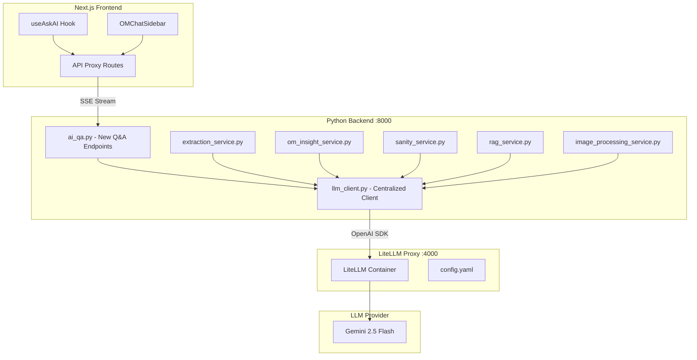

# LiteLLM Proxy - Complete AI Migration

## Why OpenAI SDK for Gemini?

LiteLLM proxy exposes an **OpenAI-compatible API** (the industry standard for LLM APIs). When you call LiteLLM, you use the OpenAI API format:

```
POST http://litellm:4000/v1/chat/completions
```

The `openai` Python SDK is the client that speaks this format. LiteLLM translates the request to Gemini's native API behind the scenes. This is the key benefit:

- **Write code once** using OpenAI SDK format
- **Switch providers** by only changing LiteLLM config (no code changes)
- **Unified interface** for all AI calls across the entire backend

---

## Architecture Overview



---

## Files to Create/Modify

### Phase 1: LiteLLM Docker Setup

| Action | File | Description |

|--------|------|-------------|

| Create | `Backend/litellm/config.yaml` | Gemini 2.5 Flash model config |

| Modify | `Backend/docker-compose.yml` | Add LiteLLM service |

| Modify | `Backend/.env` | Add LiteLLM env vars |

### Phase 2: Centralized LLM Client

| Action | File | Description |

|--------|------|-------------|

| Create | `Backend/services/llm_client.py` | Unified LLM client using OpenAI SDK |

| Modify | `Backend/requirements.txt` | Add `openai`, remove `google-generativeai` |

### Phase 3: Migrate Existing Backend Services

| Action | File | Current Usage |

|--------|------|---------------|

| Modify | `Backend/services/extraction_service.py` | Uses `genai.GenerativeModel` for document extraction |

| Modify | `Backend/services/om_insight_service.py` | Uses `genai` for insight generation |

| Modify | `Backend/services/sanity_service.py` | Uses `genai` for data validation |

| Modify | `Backend/services/rag_service.py` | Uses `genai` for RAG queries |

| Modify | `Backend/services/image_processing_service.py` | Uses `genai` for image analysis |

| Delete/Simplify | `Backend/services/gemini_rate_limiter.py` | LiteLLM handles rate limiting |

### Phase 4: New AI Q&A Endpoints

| Action | File | Description |

|--------|------|-------------|

| Create | `Backend/schemas/ai_qa.py` | Pydantic request/response models |

| Create | `Backend/api/v1/endpoints/ai_qa.py` | Streaming Q&A endpoints |

| Modify | `Backend/main.py` | Register ai_qa router |

### Phase 5: Frontend Proxy Conversion

| Action | File | Description |

|--------|------|-------------|

| Modify | `Frontend/src/app/api/project-qa/route.ts` | Convert to streaming proxy |

| Modify | `Frontend/src/app/api/borrower-qa/route.ts` | Convert to streaming proxy |

| Modify | `Frontend/src/app/api/om-qa/route.ts` | Convert to streaming proxy |

---

## Implementation Details

### 1. LiteLLM Configuration

Create [Backend/litellm/config.yaml](Backend/litellm/config.yaml):

```yaml
model_list:
  # Gemini 2.5 Flash - Load balanced across 13 API keys
  # LiteLLM will distribute requests and handle rate limit retries automatically
  
  # Primary key
  - model_name: gemini-2.5-flash
    litellm_params:
      model: gemini/gemini-2.5-flash-preview-04-17
      api_key: os.environ/GEMINI_API_KEY
    model_info:
      description: "Gemini 2.5 Flash - Key 0 (Primary)"

  # Additional keys for load balancing (GEMINI_API_KEY_1 through GEMINI_API_KEY_12)
  - model_name: gemini-2.5-flash
    litellm_params:
      model: gemini/gemini-2.5-flash-preview-04-17
      api_key: os.environ/GEMINI_API_KEY_1
    model_info:
      description: "Gemini 2.5 Flash - Key 1"

  # ... repeat for GEMINI_API_KEY_2 through GEMINI_API_KEY_12 ...

  # Alias for compatibility with code expecting "default"
  - model_name: default
    litellm_params:
      model: gemini/gemini-2.5-flash-preview-04-17
      api_key: os.environ/GEMINI_API_KEY

litellm_settings:
  request_timeout: 120
  num_retries: 3
  drop_params: true

router_settings:
  # Load balancing across 13 API keys
  routing_strategy: simple-shuffle  # randomly distributes requests
  num_retries: 3
  retry_after: 60  # seconds to wait after rate limit before retrying that key
  allowed_fails: 2  # failures before temporarily removing a deployment
  cooldown_time: 300  # 5 minutes - how long to cooldown a rate-limited key

general_settings:
  master_key: os.environ/LITELLM_MASTER_KEY
```

**Key points from LiteLLM docs:**

- **Load Balancing**: Multiple deployments with the same `model_name` are load balanced automatically
- **Rate Limit Handling**: When a key hits rate limits, LiteLLM retries with a different key
- **Cooldown**: Failed/rate-limited keys are temporarily removed from rotation
- `model_name`: The alias your code uses (e.g., `gemini-2.5-flash`)
- `model`: The actual provider route (`gemini/gemini-2.5-flash-preview-04-17`)
- LiteLLM translates OpenAI SDK format to Gemini's native API automatically
- Supports Gemini-specific features: thinking/reasoning, JSON mode, tool calling, context caching

### 2. Docker Compose Update

Add to [Backend/docker-compose.yml](Backend/docker-compose.yml):

```yaml
services:
  backend:
    # ... existing config ...
    environment:
      - LITELLM_API_BASE=http://litellm:4000
      - LITELLM_API_KEY=${LITELLM_MASTER_KEY}
    depends_on:
      neo4j:
        condition: service_healthy
      litellm:
        condition: service_healthy

  litellm:
    image: ghcr.io/berriai/litellm:main-latest
    ports:
      - "4000:4000"
    volumes:
      - ./litellm/config.yaml:/app/config.yaml
    environment:
      # All 13 Gemini API keys for load balancing
      - GEMINI_API_KEY=${GEMINI_API_KEY}
      - GEMINI_API_KEY_1=${GEMINI_API_KEY_1}
      - GEMINI_API_KEY_2=${GEMINI_API_KEY_2}
      - GEMINI_API_KEY_3=${GEMINI_API_KEY_3}
      - GEMINI_API_KEY_4=${GEMINI_API_KEY_4}
      - GEMINI_API_KEY_5=${GEMINI_API_KEY_5}
      - GEMINI_API_KEY_6=${GEMINI_API_KEY_6}
      - GEMINI_API_KEY_7=${GEMINI_API_KEY_7}
      - GEMINI_API_KEY_8=${GEMINI_API_KEY_8}
      - GEMINI_API_KEY_9=${GEMINI_API_KEY_9}
      - GEMINI_API_KEY_10=${GEMINI_API_KEY_10}
      - GEMINI_API_KEY_11=${GEMINI_API_KEY_11}
      - GEMINI_API_KEY_12=${GEMINI_API_KEY_12}
      - LITELLM_MASTER_KEY=${LITELLM_MASTER_KEY}
    command: ["--config", "/app/config.yaml", "--port", "4000", "--host", "0.0.0.0"]
    healthcheck:
      test: ["CMD", "curl", "-f", "http://localhost:4000/health"]
      interval: 30s
      timeout: 10s
      retries: 3
    restart: unless-stopped
```

### 3. Centralized LLM Client

Create [Backend/services/llm_client.py](Backend/services/llm_client.py):

```python
"""
Centralized LLM Client using OpenAI SDK + LiteLLM Proxy.
All AI calls in the backend should go through this client.
"""
from openai import AsyncOpenAI, OpenAI
from typing import AsyncGenerator, Optional, List, Dict, Any, Tuple
from core.config import settings
from loguru import logger
import json

# Async client for streaming and async operations
async_client = AsyncOpenAI(
    api_key=settings.litellm_api_key,
    base_url=settings.litellm_api_base,
)

# Sync client for non-async code paths
sync_client = OpenAI(
    api_key=settings.litellm_api_key,
    base_url=settings.litellm_api_base,
)

# Default model - alias defined in LiteLLM config.yaml
# Maps to gemini/gemini-2.5-flash-preview-04-17
DEFAULT_MODEL = "gemini-2.5-flash"


async def chat_completion(
    messages: List[Dict[str, str]],
    model: str = DEFAULT_MODEL,
    temperature: float = 0.7,
    max_tokens: Optional[int] = None,
    response_format: Optional[Dict] = None,
) -> str:
    """Non-streaming chat completion."""
    response = await async_client.chat.completions.create(
        model=model,
        messages=messages,
        temperature=temperature,
        max_tokens=max_tokens,
        response_format=response_format,
    )
    return response.choices[0].message.content


async def chat_completion_stream(
    messages: List[Dict[str, str]],
    model: str = DEFAULT_MODEL,
    temperature: float = 0.7,
) -> AsyncGenerator[str, None]:
    """Streaming chat completion - yields content chunks."""
    stream = await async_client.chat.completions.create(
        model=model,
        messages=messages,
        temperature=temperature,
        stream=True,
    )
    async for chunk in stream:
        if chunk.choices[0].delta.content:
            yield chunk.choices[0].delta.content


def chat_completion_sync(
    messages: List[Dict[str, str]],
    model: str = DEFAULT_MODEL,
    temperature: float = 0.7,
    response_format: Optional[Dict] = None,
) -> str:
    """Synchronous chat completion for non-async code paths."""
    response = sync_client.chat.completions.create(
        model=model,
        messages=messages,
        temperature=temperature,
        response_format=response_format,
    )
    return response.choices[0].message.content


async def generate_json(
    prompt: str,
    system_prompt: str,
    model: str = DEFAULT_MODEL,
) -> Dict[str, Any]:
    """Generate structured JSON response."""
    response = await chat_completion(
        messages=[
            {"role": "system", "content": system_prompt},
            {"role": "user", "content": prompt},
        ],
        model=model,
        temperature=0.3,  # Lower temp for structured output
        response_format={"type": "json_object"},
    )
    return json.loads(response)


async def chat_with_reasoning(
    messages: List[Dict[str, str]],
    model: str = DEFAULT_MODEL,
    reasoning_effort: str = "low",  # "none", "low", "medium", "high"
) -> Tuple[str, Optional[str]]:
    """
    Chat completion with Gemini's thinking/reasoning.
    Returns (content, reasoning_content).
    
    reasoning_effort options:
    - "none": Disable thinking (96% cheaper)
    - "low": 1024 budget tokens
    - "medium": 2048 budget tokens
    - "high": 4096 budget tokens
    """
    response = await async_client.chat.completions.create(
        model=model,
        messages=messages,
        extra_body={"reasoning_effort": reasoning_effort},
    )
    choice = response.choices[0]
    return (
        choice.message.content,
        getattr(choice.message, 'reasoning_content', None)
    )
```

### 4. Migration Pattern for Existing Services

Example migration for [Backend/services/extraction_service.py](Backend/services/extraction_service.py):

**Before:**

```python
import google.generativeai as genai
genai.configure(api_key=settings.gemini_api_key)
model = genai.GenerativeModel("gemini-2.5-flash")
response = model.generate_content(prompt)
```

**After:**

```python
from services.llm_client import chat_completion, generate_json

response = await chat_completion(
    messages=[
        {"role": "system", "content": system_prompt},
        {"role": "user", "content": prompt},
    ],
)
```

### 5. New AI Q&A Router

Create [Backend/api/v1/endpoints/ai_qa.py](Backend/api/v1/endpoints/ai_qa.py) with streaming endpoints that use the centralized LLM client.

### 6. Frontend Proxy Pattern

Convert each AI route to a streaming proxy:

```typescript
// Frontend/src/app/api/project-qa/route.ts
const response = await fetch(`${backendUrl}/api/v1/ai/project-qa`, {
  method: 'POST',
  headers: { 'Content-Type': 'application/json' },
  body: JSON.stringify(body),
});
return new NextResponse(response.body, {
  headers: { 'Content-Type': 'text/event-stream' },
});
```

---

## Environment Variables

Add to [Backend/.env](Backend/.env):

```bash
# LiteLLM Proxy
LITELLM_MASTER_KEY=sk-capmatch-litellm-secret
LITELLM_API_BASE=http://litellm:4000

# LLM Provider Keys (used by LiteLLM container)
GEMINI_API_KEY=your-gemini-api-key
```

Add to [Backend/core/config.py](Backend/core/config.py):

```python
litellm_api_key: str = Field(default="sk-capmatch-litellm-secret")
litellm_api_base: str = Field(default="http://localhost:4000")
```

---

## Requirements.txt Changes

```diff
- google-generativeai
+ openai>=1.30.0
```

Note: `raganything` may still require `google-generativeai` as a transitive dependency. Check if it can be configured to use a custom LLM client.

---

## Testing Checklist

1. Start services: `docker-compose up -d`
2. Verify LiteLLM health: `curl http://localhost:4000/health`
3. Test LLM client directly in Python
4. Test extraction service with a sample document
5. Test OM insight generation
6. Test new Q&A endpoints via backend: `POST http://localhost:8000/api/v1/ai/project-qa`
7. Test via frontend proxy: `POST http://localhost:3000/api/project-qa`
8. Verify streaming works in browser with Ask AI feature

---

## Rollback Strategy

If issues arise:

1. Keep `google-generativeai` in requirements as fallback
2. Add feature flag to switch between LiteLLM and direct Gemini calls
3. Stop LiteLLM container: `docker-compose stop litellm`
4. Revert `llm_client.py` to use `google-generativeai` directly