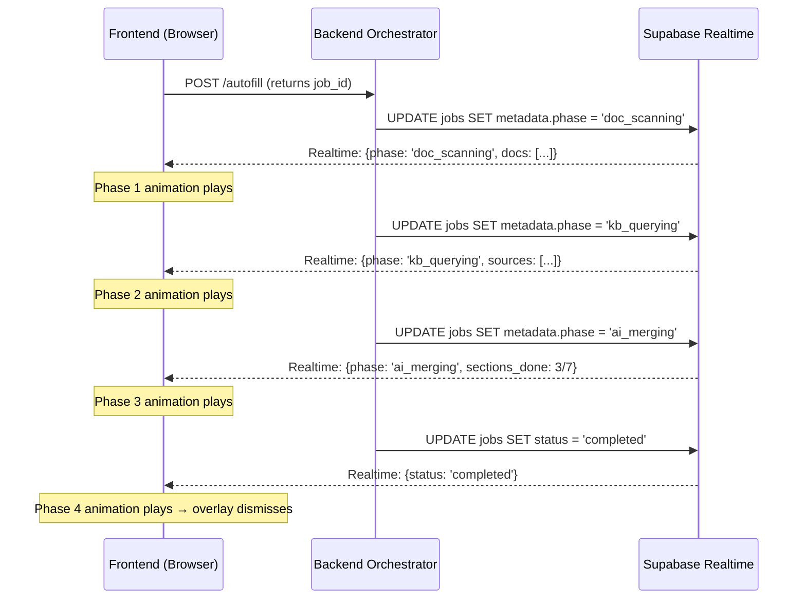

# Immersive Autofill Loading Experience

## Problem
When users click **Autofill**, the backend orchestrator runs a multi-minute pipeline (document OCR → relevance mapping → subsection extraction → knowledge base querying → sanity checks → merge → save). During this time the user sees only a spinning `<Loader2>` icon and the text "Autofilling..." — there is **zero visibility** into what's happening.

## Goal
Replace the boring spinner with a **show-stopping, full-screen orchestration visualization** that tells the user exactly what the system is doing at each stage, using animations so compelling they're *glad* the process takes a minute.

---

## Architecture Overview



---

## Proposed Changes

### Component 1: Backend — Progress Broadcasting

> [!IMPORTANT]
> The `jobs` table already has a `metadata` JSONB column, and the frontend already subscribes to `postgres_changes` on the `jobs` table filtered by `id=eq.${jobId}`. We can broadcast progress by simply updating `metadata` at key orchestrator milestones — **zero schema changes needed**.

#### [MODIFY] [orchestrator.py](file:///d:/Career/Technology/Job/CapMatch/Backend/services/orchestrator.py)

Add granular progress updates at each pipeline phase. We'll emit updates through the existing `job_repo.update_status()` metadata merge:

**Phase checkpoints to add:**

| Phase Key | When Emitted | Metadata Payload |
|---|---|---|
| `doc_scanning` | After `check_and_get_documents()` returns | `{ phase: "doc_scanning", total_docs: N, doc_names: [...] }` |
| `doc_extracting` | Before `extract_all_documents()` | `{ phase: "doc_extracting", total_subsections: N }` |
| `kb_querying` | Before `_extract_all_kb_subsections()` | `{ phase: "kb_querying", sources: ["Census", "BLS", "HUD", ...] }` |
| `ai_merging` | Before `sanity_service.perform_sanity_checks()` | `{ phase: "ai_merging", doc_fields: N, kb_fields: N }` |
| `saving` | Before final DB write | `{ phase: "saving", total_fields: N }` |

Implementation: Insert ~5 calls to `job_repo.update_status(job_id, "running", metadata={...})` at the corresponding points in `_analyze_resume()`. The existing Supabase Realtime subscription will automatically broadcast these changes.

**KB Data Sources List** — derived from your 17 knowledgebase pipeline flows:

```python
KB_SOURCES = [
    "US Census", "BLS (Labor)", "HUD (Housing)", "FRED (Economic)",
    "FHFA (Housing Finance)", "Redfin (Real Estate)", "RentCafe (Rentals)",
    "FEMA (Disaster)", "EPA (Environmental)", "USGS (Geological)",
    "USFWS (Wildlife)", "NPS (Parks)", "NHGIS (Historical)",
    "CDFI (Community Dev)", "Eviction Lab", "Good Jobs First",
    "Municipal Data"
]
```

---

### Component 2: Frontend — The AutofillOrchestrator Overlay

#### [NEW] [AutofillOrchestrator.tsx](file:///d:/Career/Technology/Job/CapMatch/Frontend/src/components/ui/AutofillOrchestrator.tsx)

A full-screen (or full-panel) overlay that renders on top of the resume form when `isAutofilling === true`. This is the centerpiece of the entire feature.

**4 Animated Phases:**

---

##### Phase 1: Document Scanning 📄
*"Scanning your documents..."*

Visual Concept:
- **Animated Document Stack** — 3D-perspective stack of document pages (like fanning out a deck of cards). Each document animates in from the left with the actual file name shown on the "page".
- A **scanning laser-line** sweeps vertically across each document page, reminiscent of a flatbed scanner.
- As each document is "scanned," it slides to the right, and highlighted text fragments pulse/glow on the page to suggest OCR extraction.
- A **progress counter** shows "Scanning document 2 of 5..."

Key animations (Framer Motion):
- Document fan-in: `x: -200 → 0`, `rotateY: -30° → 0°`
- Scan line: `y: 0% → 100%`, repeating, neon-blue glow
- Text highlight shimmer using pulsating gradient masks

---

##### Phase 2: Knowledge Graph Querying 🧠
*"Querying knowledge base from 17 data sources..."*

Visual Concept:
- **Animated Knowledge Graph** — a force-directed node graph rendered using **Three.js** (already in `package.json`!) or as a 2D SVG/Canvas animation. 
  - A central **property node** (glowing, labeled with the address) sits at the center.
  - Orbiting **data source nodes** (each one a badge with an icon — Census, BLS, HUD, etc.) fly in one-by-one and connect to the center with animated connection lines (like neural pathways lighting up).
  - Each connection line pulses with flowing particles (data flowing from source → property).
- **Source badges** appear in a staggered list below, each checking off with a ✓ animation as the backend reports progress.
- This phase has the most visual "wow factor" potential — a living, breathing knowledge graph.

Key animations:
- Node entrance: `scale: 0 → 1`, spring physics
- Connection lines: SVG `stroke-dashoffset` animation (drawing effect)
- Flowing particles along paths: CSS/JS particle system
- Source badges: `opacity: 0 → 1` + slide-up, staggered delay

Data source icon mapping:
| Source | Icon (Lucide) | Color |
|---|---|---|
| US Census | `Users` | `#4F46E5` |
| BLS (Labor) | `Briefcase` | `#059669` |
| HUD (Housing) | `Home` | `#D97706` |
| FRED (Economic) | `TrendingUp` | `#DC2626` |
| FHFA | `Building` | `#7C3AED` |
| Redfin | `MapPin` | `#E11D48` |
| RentCafe | `DollarSign` | `#0891B2` |
| FEMA | `Shield` | `#EA580C` |
| EPA | `Leaf` | `#16A34A` |
| USGS | `Mountain` | `#78716C` |
| USFWS | `Bird` | `#65A30D` |
| NPS | `Trees` | `#15803D` |
| NHGIS | `Clock` | `#6366F1` |
| CDFI | `HandCoins` | `#CA8A04` |
| Eviction Lab | `AlertTriangle` | `#F59E0B` |
| Good Jobs First | `Award` | `#8B5CF6` |
| Municipal | `Landmark` | `#0D9488` |

---

##### Phase 3: AI Merge & Sanity Check ⚡
*"AI is reconciling data from documents and knowledge base..."*

Visual Concept:
- **Split-stream merge animation** — two data streams (one labeled "Documents", one labeled "Knowledge Base") flow as parallel particulate rivers from left and right toward a central AI processing node (glowing brain/chip icon).
- The central node pulses rhythmically as if "thinking."
- Merged data particles emerge from the bottom of the node and flow downward toward the form.
- A **live counter** shows "Reconciled 42 of 68 fields..."
- Small "conflict resolution" sparks appear occasionally (orange/yellow flashes) to indicate the sanity checks are resolving disagreements.

Key animations:
- Particle streams: CSS `@keyframes` or Canvas
- Central node pulse: `scale: 1 → 1.15 → 1`, breathing rhythm
- Conflict sparks: Random position, flash + fade

---

##### Phase 4: Populating Form ✨
*"Writing results to your resume..."*

Visual Concept:
- The overlay becomes semi-transparent, revealing the actual form underneath.
- **Typewriter animation** — form fields appear to fill in one-by-one with a typing cursor effect.
- A **field counter** shows "Filled 15 of 68 fields" incrementing rapidly.
- Small **sparkle bursts** (already partially implemented via `showSparkles`) appear at each field location.
- The form sections glow momentarily as they receive data.
- Finally, a **celebratory completion animation** — a burst of confetti particles + "✓ Autofill Complete!" with a smooth number counter showing fields filled.

This phase is faster than the others (it's just the DB write), so it serves as the satisfying "landing."

---

**Component Props & State:**

```typescript
interface AutofillOrchestratorProps {
  isActive: boolean;
  phase: AutofillPhase;
  metadata: AutofillProgressMetadata;
  onComplete: () => void;
}

type AutofillPhase = 
  | 'initializing' 
  | 'doc_scanning' 
  | 'doc_extracting' 
  | 'kb_querying' 
  | 'ai_merging' 
  | 'saving' 
  | 'completed';

interface AutofillProgressMetadata {
  total_docs?: number;
  doc_names?: string[];
  total_subsections?: number;
  sources?: string[];
  doc_fields?: number;
  kb_fields?: number;
  total_fields?: number;
}
```

---

#### [MODIFY] [useAutofill.ts](file:///d:/Career/Technology/Job/CapMatch/Frontend/src/hooks/useAutofill.ts)

Extend the hook to expose progress metadata from the Realtime subscription:

- Add `progressPhase` and `progressMetadata` state fields.
- In the `postgres_changes` callback, before checking for terminal statuses (`completed`/`failed`), read `row.metadata.phase` and update the states.
- Return `progressPhase` and `progressMetadata` from the hook.

```typescript
// New state
const [progressPhase, setProgressPhase] = useState<AutofillPhase>('initializing');
const [progressMetadata, setProgressMetadata] = useState<AutofillProgressMetadata>({});

// In the Realtime callback:
if (row.metadata?.phase) {
  setProgressPhase(row.metadata.phase);
  setProgressMetadata(row.metadata);
}
```

---

#### [MODIFY] [ProjectResumeView.tsx](file:///d:/Career/Technology/Job/CapMatch/Frontend/src/components/project/ProjectResumeView.tsx)

- Import and render `<AutofillOrchestrator>` when `isAutofilling` is true, passing `progressPhase` and `progressMetadata` from the hook.
- The overlay renders as a `position: fixed` or `absolute` layer over the resume card.

#### [MODIFY] [BorrowerResumeView.tsx](file:///d:/Career/Technology/Job/CapMatch/Frontend/src/components/forms/BorrowerResumeView.tsx)

- Same integration as `ProjectResumeView.tsx`.

#### [MODIFY] [EnhancedProjectForm.tsx](file:///d:/Career/Technology/Job/CapMatch/Frontend/src/components/forms/EnhancedProjectForm.tsx)

- Same integration for the edit mode form.

#### [MODIFY] [BorrowerResumeForm.tsx](file:///d:/Career/Technology/Job/CapMatch/Frontend/src/components/forms/BorrowerResumeForm.tsx)

- Same integration for the borrower edit mode form.

---

### Component 3: Supporting Animations

#### [NEW] [DocumentScanAnimation.tsx](file:///d:/Career/Technology/Job/CapMatch/Frontend/src/components/ui/autofill/DocumentScanAnimation.tsx)

Isolated component for Phase 1. Uses Framer Motion for document cards + scan line.

#### [NEW] [KnowledgeGraphAnimation.tsx](file:///d:/Career/Technology/Job/CapMatch/Frontend/src/components/ui/autofill/KnowledgeGraphAnimation.tsx)

Isolated component for Phase 2. Renders the animated node graph with Three.js (or a performant 2D Canvas fallback). This is the "hero" animation.

#### [NEW] [DataMergeAnimation.tsx](file:///d:/Career/Technology/Job/CapMatch/Frontend/src/components/ui/autofill/DataMergeAnimation.tsx)

Isolated component for Phase 3. Two merging particle streams.

#### [NEW] [FormPopulationAnimation.tsx](file:///d:/Career/Technology/Job/CapMatch/Frontend/src/components/ui/autofill/FormPopulationAnimation.tsx)

Isolated component for Phase 4. Typewriter + sparkle effects.

---

## User Review Required

> [!IMPORTANT]
> **Three.js for Knowledge Graph?** Your project already has `three` and `@types/three` as dependencies. I'd like to use it for a stunning 3D knowledge graph in Phase 2. Alternatively, I can do a 2D SVG/Canvas version which is lighter but less "wow factor." Which do you prefer?

> [!IMPORTANT]
> **Overlay scope**: Should the overlay cover the entire page (full-screen modal-like) or just the resume panel? Full-screen is more immersive but more intrusive. Panel-only keeps navigation accessible.

> [!IMPORTANT]
> **Fallback/skip behavior**: Should there be a "minimize" or "skip" button so power users can dismiss the visualization and just wait with the simple spinner? Or do we want to force the experience?

> [!WARNING]
> **Backend changes required**: The progress broadcasting requires ~5 additional database UPDATE calls during autofill (one per phase transition). These are lightweight (metadata JSONB merge) and should not impact performance, but they do add minor latency (~5-10ms per update). Since autofill takes 1-5 minutes total, this is negligible.

---

## Open Questions

1. **Phase timing simulation**: If the backend processes phases faster than the animations can play, should we add minimum display durations per phase (e.g., show Phase 1 for at least 3 seconds even if doc scanning takes 1 second)? This ensures animations don't flash too quickly.

2. **Sound effects**: Would subtle sound effects (typing, whoosh, chime) enhance the experience, or are they unwanted? They could be optional.

3. **Color scheme**: Should the visualization use the existing blue/white CapMatch theme, or should we use a darker "command center" aesthetic (dark bg with neon accents) for the overlay to create contrast?

---

## Verification Plan

### Automated Tests
- Run `/run-lint-compile` to ensure TypeScript compiles cleanly.
- Run existing `vitest` tests to ensure no regressions in `useAutofill` hook.

### Manual Verification
- **Trigger autofill** on a project with uploaded documents and verify:
  - All 4 phases animate in sequence.
  - Phase transitions are driven by backend Realtime events (not just timers).
  - Completion animation plays and overlay dismisses.
  - Form data is populated correctly after overlay clears.
- **Error case**: Kill the backend mid-autofill and verify the error modal still appears correctly.
- **Performance**: Ensure Three.js graph doesn't cause frame drops on mid-range hardware (target 60fps).
